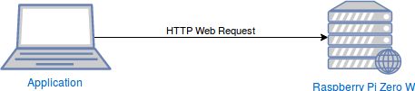
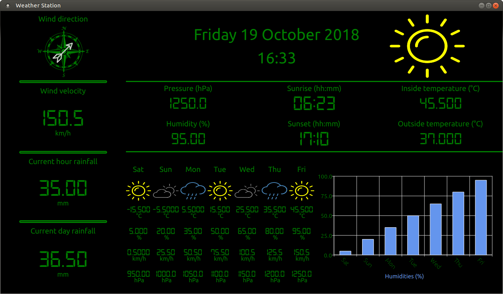

# Weather Station Application

Weather station application, developped with the Qt Framework, collects weather informations from a web server on a Raspberry Pi Zero W with Django REST Framework.

## System schema

## Software

### [Application (Qt Framework)](https://github.com/petit-romain/Weather-Station-Application)

The application is developped in QML for the views and C++ for the data.

#### C++ Class

- QDateTime

- QLocal

- QDateTime

- QPointer

- QNetwork

- QJSon

#### QML Element

- Rectangle
  
- Text

- ProgressBar

- Image

- ColorOverlay

- Timer

- Repeater

- GridLayout

- Column

- Chartview

- BarSeries

- ValueAxis

- BarSet

### [Server (Django REST Framework)](https://github.com/petit-romain/Weather-Station-Server)

Work in Progress

## Hardware

### [Raspberry Pi Zero W](https://www.kubii.fr/pi-zero-w/1851-raspberry-pi-zero-w-kubii-3272496006997.html)

### Sensors

- [Temperature, Humidity, Pressure](https://www.lextronic.fr/temperature-meteo/19272-module-weather-click-board.html)

- [Anemometer](https://www.lextronic.fr/temperature-meteo/27644-capteur-anenometre.html)

- [Weather vane](https://www.lextronic.fr/temperature-meteo/27643-capteur-girouette.html)

- [Rain gauge](https://www.lextronic.fr/temperature-meteo/27641-capteur-pluviometre.html)

#### Electronic cards

Work in Progress

#### 3D Model for the Raspbery Pi Zero W box

Work in Progress
