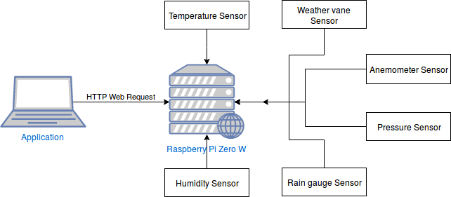

# Weather Station Application

Weather station application, developped with the Qt Framework, collects weather informations from a web server on a Raspberry Pi Zero W with Django REST Framework.

## System schema

## Hardware

### Raspberry Pi Zero W

### Sensor

#### Temperature, Humidity, Pressure

#### Anemometer, Weather vane, Rain gauge

## Software

### Application (Qt Framework)

### Server (Django REST Framework)
